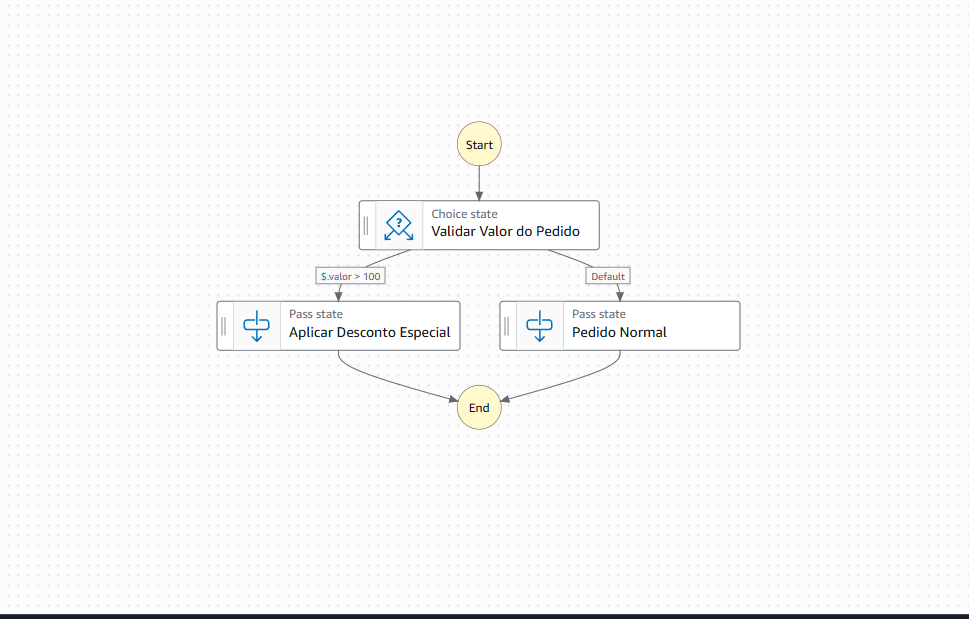
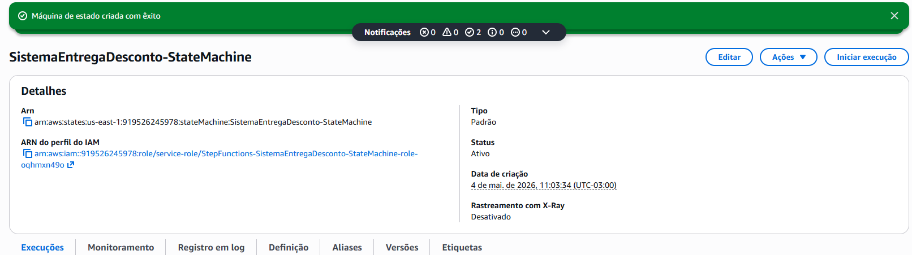

# 🚀 Orquestração de Processos com AWS Step Functions

## 📝 Descrição do Projeto
Este projeto foi desenvolvido como parte de um desafio técnico para a **DIO (Digital Innovation One)**. O objetivo principal é demonstrar como utilizar o **AWS Step Functions** para orquestrar um fluxo de trabalho (workflow) automatizado no modelo **Serverless**.

O cenário escolhido foi um **Sistema de Entrega com Desconto**, onde a máquina de estados toma decisões lógicas baseadas em dados de entrada, simulando um processo real de e-commerce ou delivery.

---

## 🛠️ Tecnologias Utilizadas
*   **AWS Step Functions**: Orquestração do workflow.
*   **Amazon States Language (ASL)**: Linguagem baseada em JSON para definir a máquina de estados.
*   **JSONPath**: Utilizado para manipulação e consulta de dados no fluxo.
*   **GitHub**: Para versionamento de código e documentação técnica.

---

## 🏗️ Arquitetura do Workflow

A máquina de estados segue a seguinte lógica:

1.  **Início (Start)**: O fluxo recebe um JSON contendo o valor do pedido.
2.  **Validação (Choice State)**: Verifica se o valor é superior a **100**.
3.  **Caminhos (Pass States)**:
    *   **Sim**: O fluxo segue para a etapa "Aplicar Desconto Especial".
    *   **Não (Default)**: O fluxo segue para a etapa "Pedido Normal".
4.  **Fim (End)**: O processo é encerrado com sucesso.

---

## 📊 Visualização do Workflow

### Diagrama de Estados


### Teste de Execução (Sucesso)


---

## 🧠 Insights e Desafios Encontrados

Durante a implementação, um desafio técnico relevante surgiu:
*   **Erro de Sintaxe**: Inicialmente, foi identificada uma falha ao utilizar expressões complexas de JSONata que geravam o erro *"Reference to '$' at the top level is not supported"*.
*   **Solução**: A correção foi aplicada migrando para a sintaxe **JSONPath** padrão da AWS, utilizando as propriedades `Variable` e `NumericGreaterThan`. Isso demonstrou a importância de conhecer as especificidades da **Amazon States Language (ASL)** para garantir a compatibilidade do serviço.

---

## 🚀 Como Testar
Para validar o funcionamento, utilize os seguintes inputs no console da AWS:

**Cenário 1: Com Desconto**
```json
{
  "valor": 120
}
