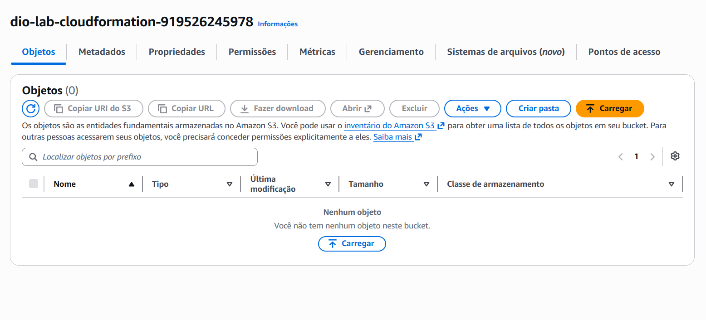

# 🚀 Jornada AWS - Orquestração e Infraestrutura (DIO)

## 📝 Descrição do Projeto
Este projeto foi desenvolvido como parte de um desafio técnico para a **DIO (Digital Innovation One)**. O objetivo é demonstrar o uso de serviços AWS para orquestração de processos (**Step Functions**) e infraestrutura como código (**CloudFormation**).

---

## 🏗️ Projeto 1: Orquestração com Step Functions

O cenário escolhido foi um **Sistema de Entrega com Desconto**, onde a máquina de estados toma decisões lógicas baseadas em dados de entrada.

### 🛠️ Tecnologias Utilizadas
* **AWS Step Functions**: Orquestração do workflow.
* **Amazon States Language (ASL)**: Definição da máquina de estados.
* **JSONPath**: Manipulação e consulta de dados.

### 📊 Visualização
* **Diagrama de Estados**: 
* **Execução com Sucesso**: 

---

## ☁️ Projeto 2: Infraestrutura com CloudFormation

Neste segundo desafio, implementamos o provisionamento automatizado de um recurso de armazenamento (S3) utilizando um template YAML.

### 🛠️ Tecnologias Utilizadas
* **AWS CloudFormation**: Gerenciamento de Stacks.
* **YAML**: Escrita do template de infraestrutura.
* **Amazon S3**: Recurso provisionado automaticamente.

### 📊 Evidência de Sucesso
O status **CREATE_COMPLETE** confirma que a infraestrutura foi criada sem erros:



---

## 🧠 Insights e Desafios Encontrados

* **Correção de Sintaxe**: A migração de JSONata para **JSONPath** no Step Functions foi crucial para resolver erros de referência (`$`).
* **Automação com IaC**: O CloudFormation demonstrou como reduzir erros manuais e garantir que a infraestrutura seja idêntica em qualquer conta AWS.
* **Monitoramento**: O uso do **CloudWatch** e **CloudTrail** permitiu auditar as ações e monitorar a saúde dos serviços em tempo real.

---

## 🚀 Como Testar (Step Functions)
Para validar o funcionamento, utilize o seguinte input no console da AWS:

```json
{
  "valor": 120
}
